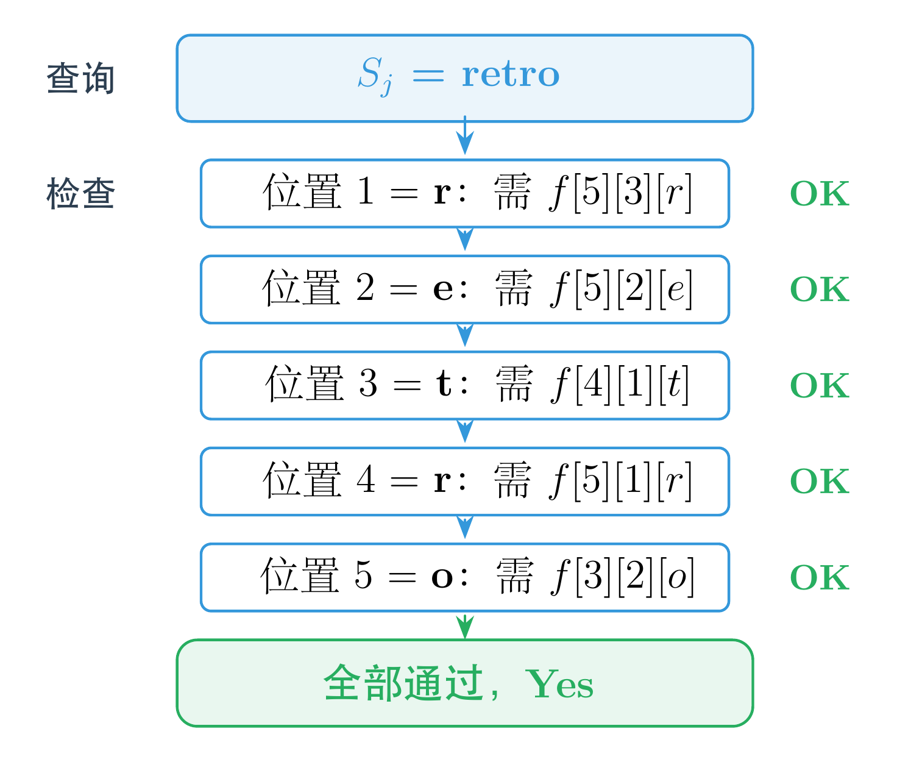
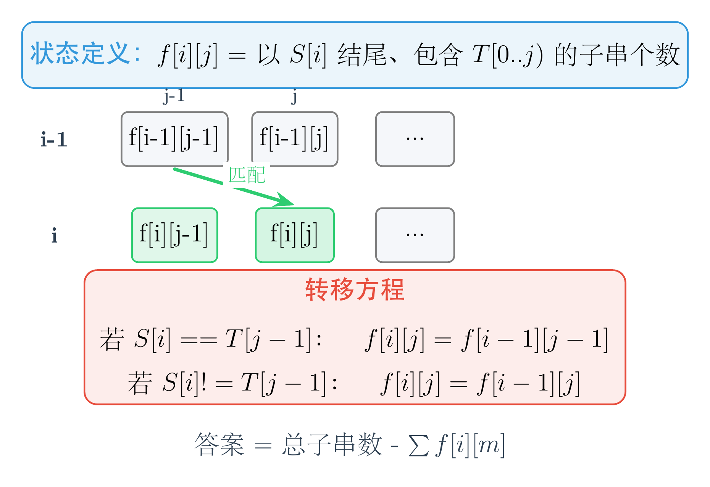

# ABC452 题解：预处理与正难则反，两道思维型题目

## 一、为什么选这两道题来写

AtCoder Beginner Contest 的 C 题和 D 题，往往是检验选手是否具备<span style="color:#e74c3c">算法思维</span>的分水岭。它们通常不需要高深的模板，但对问题的观察角度和转化能力有很高要求。

这次 ABC452 的两道题恰好对应了两种非常实用的解题思想：

- <span style="color:#e74c3c">C 题 — 预处理 + 多条件判定</span>：N 很小，但 M 很大，需要把查询前的预处理做到极致。
- <span style="color:#2980b9">D 题 — 正难则反 + 线性 DP</span>：直接统计"不包含 T"很困难，转而统计"包含 T"再从总数中扣除。

这两种思想在算法竞赛中无处不在。预处理能把 O(M × N × 某值) 的暴力查询降到 O(M × N)；正难则反能把一个看似需要容斥或复杂条件的计数问题，变成一道简洁的线性递推。掌握它们，相当于在工具箱里多了两把趁手的利器。

下面进入具体的题目分析。

---

## 二、C 题：Fishbones（预处理判定）

### 题意

有一个鱼骨架，由 N 根肋骨和 1 根脊柱组成。艺术家要在每根骨头上写一个字符串，满足：

- 脊柱上的字符串长度为 N。
- 第 i 根肋骨上的字符串长度为 A_i，且它的第 B_i 个字符必须等于脊柱的第 i 个字符。
- 所有骨头上的字符串都必须来自给定的字符串集合 {S_1, S_2, …, S_M}（允许重复）。

现在对于每个 S_j，问：是否存在一种合法的写法，使得脊柱上的字符串恰好是 S_j？

### 举个例子

用题目样例的数据来走一遍。N = 5，五根肋骨的约束如下：

| 肋骨 i | 长度 A_i | 位置 B_i |
|:---:|:---:|:---:|
| 1 | 5 | 3 |
| 2 | 5 | 2 |
| 3 | 4 | 1 |
| 4 | 5 | 1 |
| 5 | 3 | 2 |

字符串池中有：chris、retro、tuna、cod。

**查询 1：S_j = "retro"（长度 = 5 = N）**

逐个位置检查：
1. 脊柱第 1 位是 'r' → 肋骨 1 需满足 (5, 3) = 'r' → chris 的第 3 位正好是 'r' → <span style="color:#27ae60">满足</span>
2. 脊柱第 2 位是 'e' → 肋骨 2 需满足 (5, 2) = 'e' → retro 的第 2 位正好是 'e' → <span style="color:#27ae60">满足</span>
3. 脊柱第 3 位是 't' → 肋骨 3 需满足 (4, 1) = 't' → tuna 的第 1 位正好是 't' → <span style="color:#27ae60">满足</span>
4. 脊柱第 4 位是 'r' → 肋骨 4 需满足 (5, 1) = 'r' → retro 的第 1 位正好是 'r' → <span style="color:#27ae60">满足</span>
5. 脊柱第 5 位是 'o' → 肋骨 5 需满足 (3, 2) = 'o' → cod 的第 2 位正好是 'o' → <span style="color:#27ae60">满足</span>

5 个位置全部满足，答案是 <span style="color:#27ae60">Yes</span>。

**查询 2：S_j = "cod"（长度 = 3 ≠ 5）**

长度就不等于 N，直接回答 <span style="color:#e74c3c">No</span>。

**查询 3：S_j = "crab"（长度 = 4 ≠ 5）**

同样直接回答 <span style="color:#e74c3c">No</span>。

### 关键观察

N ≤ 10，非常小；但 M 最大有 2 × 10^5，非常大。

如果对每个 S_j 都暴力枚举每根肋骨选哪个字符串，每根肋骨有 M 种选择，N 根肋骨就是 M^N 种组合。最坏情况下 M = 2 × 10^5，N = 10，M^N 是一个天文数字，完全不可行。

换个角度想：我们其实并不关心每根肋骨具体选了哪个字符串，只关心<span style="color:#e74c3c">某个位置上是否有某个字符</span>。

具体来说，对于第 i 根肋骨，它需要满足的条件是：存在一个长度为 A_i 的字符串，其第 B_i 位恰好是脊柱的第 i 个字符 c。这个条件只跟三个因素有关：长度 A_i、位置 B_i、字符 c。它跟脊柱的其他字符完全无关，跟其他肋骨也无关。

因此可以事先把所有 S_1 到 S_M 拆解成特征信息：

```
f[len][pos][c] = true  表示存在一个长度为 len 的字符串，其第 pos 位是字符 c
```

这个数组的维度是 11 × 11 × 26，非常小。遍历一遍 M 个字符串就能预处理完成。

### 判定过程

对于每个查询 S_j：

1. 如果 |S_j| ≠ N，直接输出 No。
2. 否则，对脊柱的每个位置 i（1 ≤ i ≤ N），检查 f[A_i][B_i][S_j[i]] 是否为 true。
3. 如果全部满足，输出 Yes；否则输出 No。

单次查询只需 O(N) 时间，总复杂度 O(M × N)，轻松通过。

下图展示了判定流程：



### 代码

```cpp
#include<bits/stdc++.h>
using namespace std;

bool f[11][11][26];

int main(){
    int n; cin >> n;
    vector<int> a(n),b(n);
    for(int i=0;i<n;++i) cin >> a[i] >> b[i];
    
    int m; cin >> m;
    vector<string> s(m);
    for(int i=0;i<m;++i) cin >> s[i];

    for(int i=0;i<m;++i){
        int len = s[i].size();
        for(int j=0;j<s[i].size();++j)
            f[len][j+1][s[i][j]-'a'] = true;
    }
    for(auto t:s){
        if(t.size()!=n){
            cout << "No\n";
            continue;
        }
        bool flag = true;
        for(int j=0;j<n;++j)
            flag &= f[a[j]][b[j]][t[j]-'a'];
        cout << (flag?"Yes\n":"No\n");
    }
    return 0;
}
```

### 代码解析

1. **数组 `f[len][pos][c]` 是核心数据结构**。预处理阶段遍历所有 M 个字符串，把每个字符串的每个字符"登记"到对应的长度、位置和字符维度上。

2. **`f[len][j+1][s[i][j]-'a'] = true`** 这行是预处理的本质：不关心字符串的具体内容，只记录"某个长度、某个位置上有没有某个字符"。

3. **查询阶段用 `auto t:s` 遍历**，相比用下标更简洁。`t.size()!=n` 时直接输出 No，这是一个快速剪枝。

4. **`flag &= f[a[j]][b[j]][t[j]-'a']`** 利用按位与的短路特性，一旦某个位置不满足，flag 立刻变为 false，后续检查可以跳过（虽然 N 很小，这个优化意义不大，但写法很简洁）。

---

## 三、D 题：No-Subsequence Substring（正难则反 + 线性 DP）

### 题意

给定两个字符串 S 和 T。统计 S 的<span style="color:#e74c3c">所有非空子串</span>中，有多少个<span style="color:#2980b9">不包含 T 作为子序列</span>。

注意：两个子串即使内容相同，只要取自 S 的不同位置，就算不同的子串。

### 举个例子

S = "abc"，T = "ac"。

S 的所有非空子串有 6 个："a"、"b"、"c"、"ab"、"bc"、"abc"。

哪些包含 "ac" 作为子序列？
- "a"：只有 'a'，没有 'c' → 不包含
- "b"：没有 'a' 也没有 'c' → 不包含
- "c"：只有 'c'，没有 'a' → 不包含
- "ab"：有 'a' 但没有 'c' → 不包含
- "bc"：没有 'a' → 不包含
- "abc"：'a' 后面有 'c' → <span style="color:#e74c3c">包含</span>

所以不包含 "ac" 的子串有 5 个，答案就是 5。

### 为什么"正难则反"？

直接统计"不包含 T 作为子序列"的子串数量非常棘手。因为"不包含"意味着 T 的每一个字符都不能按顺序出现在子串中，这涉及复杂的组合限制。

但"包含 T 作为子序列"则相对容易统计。我们可以用动态递推的方式，逐个位置计算"以当前位置结尾、包含 T 作为子序列的子串个数"，然后用总子串数减去这个值即可。

总子串数是固定的：|S| × (|S| + 1) / 2。

### DP 设计

**状态定义**：`f[i][j]` 表示以 S[i] 结尾、包含 `T[0..j)`（即 T 的前 j 个字符）作为子序列的子串个数。

**转移方程**：
- `f[i][0] = i + 1`（所有以 i 结尾的子串都包含空串）
- 若 `S[i] == T[j-1]`：`f[i][j] = f[i-1][j-1]`
- 若 `S[i] != T[j-1]`：`f[i][j] = f[i-1][j]`

**答案**：总子串数 - Σf[i][m]

下图展示了核心的状态转移：



### 代码

```cpp
#include <bits/stdc++.h>
using namespace std;
using ll = long long;

int main() {
    string s, t; cin >> s >> t;
    int n = s.size();
    int m = t.size();
    ll tot = 1LL * n * (n+1) / 2;
    vector<int> f(m+1);
    for(int i=0; i<n; ++i){
        auto g = f;
        f[0] = i+1;
        for(int j=1; j<=m; ++j){
            if(s[i]==t[j-1])
                g[j] = f[j-1];
        }
        tot -= g[m];
        swap(f,g);
    }
    cout << tot << endl;
}
```

### 代码解析

1. **`tot = n*(n+1)/2`** 是 S 的所有非空子串总数。每处理一个位置 i，`g[m]` 就是以位置 i 结尾、包含完整 T 作为子序列的"坏子串"数量，从总数中扣除。

2. **`f[0] = i+1`** 的含义：以位置 i 结尾的所有子串都包含空串作为子序列，这样的子串共有 i+1 个（从位置 0 到 i 中任选一个起点）。

3. **转移的核心**：若 `S[i] == T[j-1]`，则 `g[j] = f[j-1]`。意思是：以位置 i 结尾且包含 `T[0..j)` 的子串，可以由"以位置 i-1 结尾且包含 `T[0..j-1)` 的子串"扩展而来。数量上完全相等，因为每个这样的子串后面加一个 S[i] 就得到了一个新的合法子串。

4. **一维滚动优化**：代码中只用了一维数组 `f` 和 `g`，通过 `swap` 在 O(|T|) 空间内完成递推。这是实现上的优化，不影响状态定义的理解——你可以把它想象成 `f[i][j]` 和 `f[i-1][j]` 的关系。

5. **时间复杂度 O(|S| × |T|)**，最大约 10^7，在 2 秒内完全足够；**空间复杂度 O(|T|)**，几乎不占用额外内存。

---

## 四、写在最后

C 题告诉我们：<span style="color:#e74c3c">当条件可以拆解且查询量很大时，预处理往往是突破口</span>。把问题中"是否存在某个字符串满足某条件"转化为"是否存在某个字符串具有某特征"，就能把二维的字符串匹配问题降维成三维的布尔数组查询。

D 题告诉我们：<span style="color:#2980b9">当正面计数很困难时，试试从反面入手</span>。"不包含 T"的反面是"包含 T"，而"包含 T"可以通过一个自然的前缀匹配 DP 来统计。总子串数是已知的，一减就得到答案。

这两道题都不涉及高深的算法模板，但对<span style="color:#8e44ad">观察力和问题转化能力</span>的要求很高。而这正是算法竞赛中最核心的能力——不是记住多少模板，而是看到问题时能想到最合适的切入角度。

AtCoder Beginner Contest 每周六晚上开赛。如果你正在学习算法竞赛，建议你把它变成<span style="color:#e74c3c">每周固定的练习仪式</span>。哪怕只做 A~D，长期坚持下来，对题感的提升也是肉眼可见的。

我们下周六晚上见。
