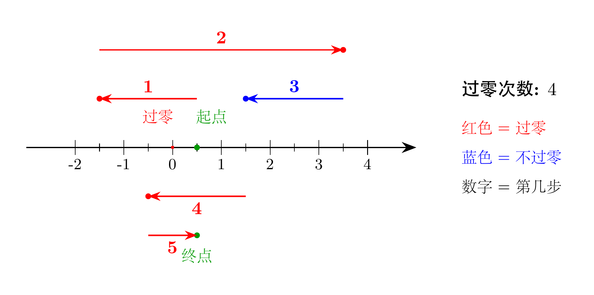
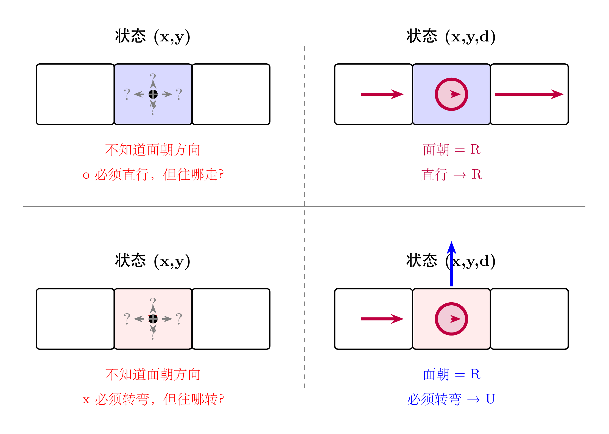
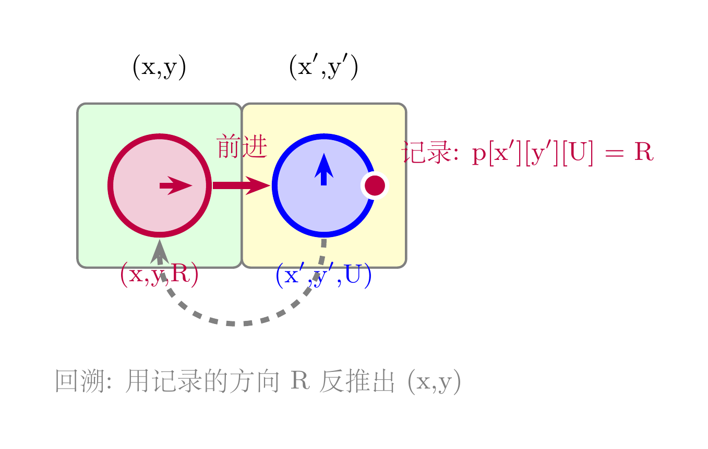
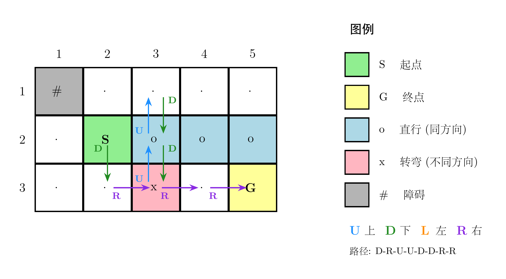

# ABC453 题解：深搜与广搜，两道分水岭题目

## 一、为什么选这两道题来写

在 AtCoder Beginner Contest 的题单里，C 题和 D 题是一道隐形的分水岭。

A、B 两题通常只需要基础语法和简单模拟，只要学过编程就能做。但从 C 题开始，题目会要求你<span style="color:#e74c3c">系统地枚举状态</span>或者<span style="color:#2980b9">在图结构上搜索路径</span>。如果这套思路没有打通，后面的 E、F 题基本无从谈起。

这次 ABC453 的 C 题和 D 题，恰好分别对应了算法竞赛中最核心的两种搜索策略：

- <span style="color:#e74c3c">C 题 — 深度优先搜索（DFS）</span>：数据范围很小，但决策空间是指数级的，需要枚举所有可能并统计最优解。
- <span style="color:#2980b9">D 题 — 广度优先搜索（BFS）</span>：网格上的最短路问题，但状态的定义需要多花一步心思。

DFS 和 BFS 之所以重要，是因为它们处于整个算法知识体系的<span style="color:#8e44ad">承上启下</span>位置。向上，它们连接着递归、栈、队列这些最基础的数据结构；向下，它们延伸出记忆化搜索、动态规划、最短路算法、连通性判断等一系列进阶工具。能把这两道题吃透，说明你已经从"会写代码"跨入了"会设计算法"的阶段。

下面进入具体的题目分析。

---

## 二、C 题：Sneaking Glances（ DFS 枚举）

### 题意

高桥初始站在数轴上的坐标 0.5 处。接下来他要走 N 步，第 i 步可以往正方向或负方向走 L_i 的距离。问：他最多能穿过坐标 0 多少次？

题目保证没有任何一步的终点恰好落在 0 上。

### 关键观察

N 的范围是 <span style="color:#e74c3c">N ≤ 20</span>。每一步只有两种选择（正或负），所以总共的决策组合数是 2^20 ≈ 100 万。这个量级对于现代计算机来说完全可以在瞬间跑完，因此直接 DFS 枚举所有方案即可。

需要注意的是：高桥一开始在 0.5，而每次移动的距离 L_i 都是整数。这意味着<span style="color:#e74c3c">他永远站在半整数位置上</span>，比如 0.5、1.5、-2.5 等等。所以他永远不会恰好踩到整数点，穿过 0 的判断只需要看<span style="color:#2980b9">起点和终点是否分别在 0 的两侧</span>。

具体来说，如果把所有坐标乘以 2（消除小数），问题变成：从 1 出发，每次 ±2L_i，判断移动前后是否跨越了 0（即符号改变）。

### 图示

下图展示了样例的最优路径：



图中绿色圆点是起点和终点，红色星号标记了每一次穿过坐标 0 的位置。5 步之中，最优方案可以穿过 0 共 <span style="color:#e74c3c">4 次</span>。

### 代码

```cpp
#include<bits/stdc++.h>
using namespace std;
typedef long long ll;
const int maxn = 22;
int L[maxn];
int n;
int maxpass = 0;
void dfs(ll x,int i,int pass){
    if(i>n){
        maxpass = max(pass,maxpass);
        return;
    }
    dfs(x+L[i],i+1,pass+(x+L[i]>0 ^ x>0));
    dfs(x-L[i],i+1,pass+(x-L[i]>0 ^ x>0));
}
int main(){
    cin >> n;
    for(int i=1;i<=n;++i) cin >> L[i];
    for(int i=1;i<=n;++i) L[i] <<= 1;
    dfs(1,1,0);
    cout << maxpass << endl;
    return 0;
}
```

### 代码解析

主函数中先把所有 L_i 乘以 2，这样初始位置 0.5 变成 1，后续所有计算都在整数域进行。

`dfs(x, i, pass)` 表示当前在坐标 x，准备走第 i 步，已经穿过 0 共 pass 次。每一步有两个分支：往正方向走或往负方向走。

判断这次移动是否穿过 0，用的是异或运算 `(x+L[i]>0 ^ x>0)`：如果移动前后坐标的正负号不同，说明跨越了 0，pass 加 1。

当 i 超过 n 时，所有步都走完了，用 maxpass 记录历史最优值。

---

## 三、D 题：Go Straight（BFS + 三维状态）

### 题意

给定一个 H × W 的网格迷宫。每个格子有以下几种类型：

- <span style="color:#27ae60">S</span> 起点 / <span style="color:#e67e22">G</span> 终点 / <span style="color:#999">.</span> 普通格子：可以自由选择下一步方向
- <span style="color:#2980b9">o</span>：进入后<span style="color:#2980b9">必须直行</span>（与上一步同方向）
- <span style="color:#e74c3c">x</span>：进入后<span style="color:#e74c3c">必须转弯</span>（不能继续上一步方向）
- <span style="color:#666">#</span>：墙，不能进入

判断是否存在从 S 到 G 的路径，如果存在输出一条具体路径。

### 为什么状态必须是 (x, y, d)？

这道题最容易卡住的地方，是状态的定义。

如果只用 <span style="color:#e74c3c">(x, y)</span> 作为状态，会出现什么问题？看看下面这张图：



左半边是"只有位置"的情况：你站在一个 o 格子上，题目要求你"直行"——但你不知道自己面朝哪个方向，所以根本不知道该往哪走。同样，站在 x 格子上要求"转弯"，也不知道该往哪转。

右半边是"位置 + 方向"的情况：当你知道自己<span style="color:#8e44ad">面朝 R（右）</span>时，o 格子要求直行，下一步只能继续往 R 走；x 格子要求转弯，下一步就只能转向上方 U。

这就是这道题最核心的设计点：<span style="color:#e74c3c">状态必须包含当前面朝的方向 d</span>。在代码中，d = 0,1,2,3 分别对应 R、D、L、U 四个方向。

### BFS 过程

状态定义为 (x, y, d)，表示"在位置 (x, y)，当前面朝方向 d，下一步将沿 d 方向移动"。

BFS 的转移规则如下：

1. 从当前状态 (x, y, d) 出发，先沿方向 d 移动一格，到达新位置 (nx, ny)
2. 检查 (nx, ny) 是否是墙或越界，如果是则跳过
3. 根据 (nx, ny) 的格子类型，确定下一步允许的方向 nd：
   - 如果是 o，nd 必须等于 d（直行）
   - 如果是 x，nd 不能等于 d（转弯）
   - 如果是 . / S / G，nd 任意
4. 如果状态 (nx, ny, nd) 未被访问过，入队

### 路径回溯

BFS 不仅能判断是否存在路径，还能通过父指针数组还原出路径本身。这里有一个精妙的设计：



当我们从状态 (x, y, d) 沿方向 d 走到 (nx, ny)，并选择新方向 nd 时，我们把<span style="color:#e74c3c">来向方向 d</span>记录到 `p[nx][ny][nd]` 中。

为什么只需要记录方向 d 就够了？因为知道了 (nx, ny) 和来向方向 d，就可以反推出前一个位置：

```
px = nx - dx[d]
py = ny - dy[d]
```

这样回溯时不需要额外存储坐标，只需要方向一个变量，既省空间又清晰。

### 完整路径图示

下图展示了样例 1 的迷宫和一条可行路径：



路径为 D-R-U-U-D-D-R-R，从 S 出发经过 o 和 x 格子，最终到达 G。

### 代码

```cpp
#include<bits/stdc++.h>
using namespace std;
typedef long long ll;
const int maxn = 1003;
char s[maxn][maxn];
int f[maxn][maxn][4];
int p[maxn][maxn][4];
int dx[]={0,1, 0,-1};
int dy[]={1,0,-1, 0};
char dc[]={'R','D','L','U'};
struct node{
    int x,y,d;
};
int main(){
    int H,W; cin >> H >> W;
    for(int i=1;i<=H;++i) scanf("%s",s[i]+1);
    int sx,sy,gx,gy;
    for(int i=1;i<=H;++i){
        for(int j=1;j<=W;++j){
            if(s[i][j]=='S') sx=i,sy=j,s[i][j]='.';
            if(s[i][j]=='G') gx=i,gy=j,s[i][j]='.';
        }
    }
    memset(f,-1,sizeof(f));
    queue<node> q;
    for(int i=0;i<4;++i){
        q.push({sx,sy,i});
        f[sx][sy][i]=0;
    }
    while(!q.empty()){
        node u = q.front(); q.pop();
        int nx = u.x + dx[u.d];
        int ny = u.y + dy[u.d];
        if(nx<1 || nx>H) continue;
        if(ny<1 || ny>W) continue;
        if(s[nx][ny]=='#') continue;
        for(int i=0;i<4;++i){
            if(s[nx][ny]=='x' && i==u.d) continue;
            if(s[nx][ny]=='o' && i!=u.d) continue;
            if(f[nx][ny][i]!=-1) continue;
            f[nx][ny][i] = f[u.x][u.y][u.d]+1;
            p[nx][ny][i] = u.d;
            q.push({nx,ny,i});
        }
    }
    if(f[gx][gy][0]==-1) return 0*puts("No");
    cout << "Yes\n";
    int x=gx,y=gy,d=0;
    vector<char> path;
    while(x!=sx || y!=sy){
        int pd = p[x][y][d];
        int px = x-dx[pd];
        int py = y-dy[pd];
        path.push_back(dc[pd]);
        x=px,y=py,d=pd;
    }
    reverse(path.begin(),path.end());
    for(int i=0;i<path.size();++i)
        cout << path[i];
    cout << endl;
    return 0;
}
```

### 代码解析

初始化阶段把 S 和 G 都替换成普通格子 `.`，方便后续统一处理。

BFS 开始前，起点 (sx, sy) 的四个方向状态都被初始化为距离 0 并入队。这是因为从起点出发时，四个方向都是可选的。

在 BFS 循环中，`u.d` 表示当前面朝的方向，先沿这个方向走一步到 (nx, ny)。然后根据新格子的类型筛选下一步允许的方向 i，满足条件的状态入队。

`p[nx][ny][i] = u.d` 记录的是：到达 (nx, ny) 且下一步面朝 i 时，上一步的面朝方向是 u.d。回溯时用这个方向反推前一个坐标。

最后从 G 倒着走回 S，收集路径上的方向字符，反转后输出。

---

## 四、写在最后

C 题告诉我们：<span style="color:#e74c3c">当数据范围允许时，大胆枚举</span>。N = 20 的情况下，2^20 的搜索量在可接受范围内，DFS 是最直接的武器。

D 题告诉我们：<span style="color:#2980b9">状态的定义往往比算法本身更重要</span>。如果只用 (x, y) 做状态，面对 o 和 x 格子就束手无策；加上方向维度 d 后，问题瞬间变得可解。

这两道题的共同点是——它们都不需要高深的算法模板，但对<span style="color:#8e44ad">问题建模的敏感度</span>有很高要求。而这种敏感度，正是从一次次实战中磨出来的。

AtCoder Beginner Contest 每周六晚上 21:00 开赛。如果你正在学习算法竞赛，强烈建议你把它变成<span style="color:#e74c3c">每周固定的练习仪式</span>。不需要每道题都做出来，哪怕只做 A~C，长期坚持下来，对题感的提升也是肉眼可见的。

我们下周六晚上见。
