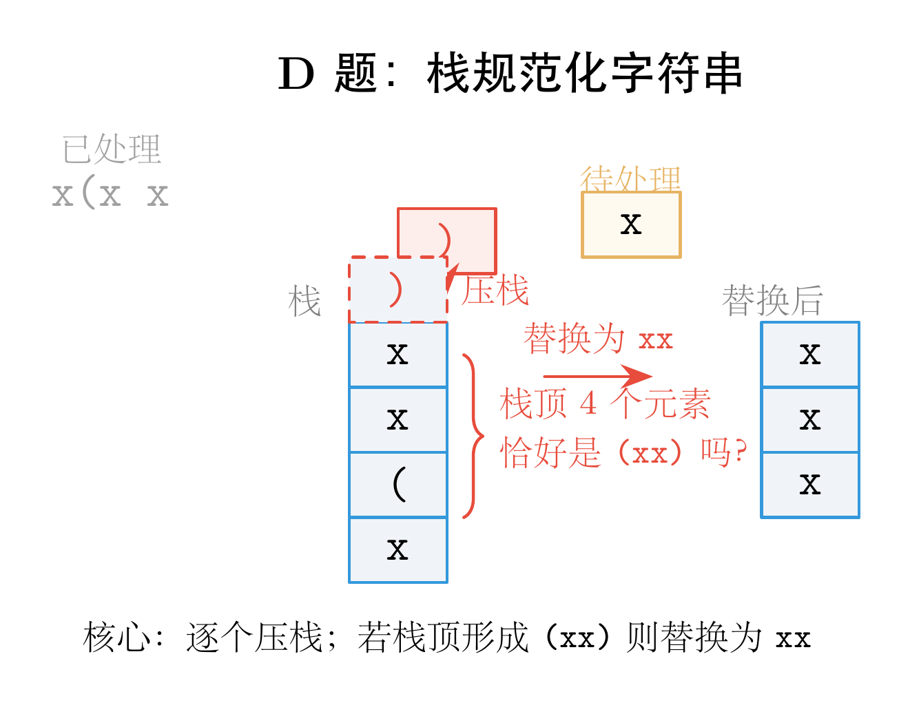

# ABC454 题解：从等价类思想到栈规范化

## 一、一道藏着数学思想的字符串题

这次 ABC454 最有意思的是 D 题。表面上看，它只是一个字符串替换游戏——把 `(xx)` 和 `xx` 来回变。但深入一层，你会发现它背后藏着一个非常漂亮的<span style="color:#e74c3c">数学思想：等价类</span>。

在数学中，等价关系需要满足三条性质：自反、对称、传递。一旦满足，集合就会被划分成若干个等价类，同一类里的元素可以互相转化，不同类之间永远绝缘。D 题的两种替换操作恰好构成了这样的等价关系。于是，判断两个字符串能否互相转换，就变成了判断它们是否属于<span style="color:#2980b9">同一个等价类</span>——而判断等价类最优雅的方法，就是为每个类找一个<span style="color:#8e44ad">唯一的代表元</span>（规范形式）。

C 题则是一道经典的图论建模题：把物品交换规则抽象成有向图，问题瞬间从"怎么换"变成了"能走到哪"。

下面进入具体的题目分析。

---

## 二、C 题：Straw Millionaire（有向图 + DFS）

### 题意

有 N 种物品，编号 1 到 N。高桥君最初只有物品 1。

他有 M 个朋友。第 i 个朋友有一个交换规则：如果把物品 A_i 给他，就能换得物品 B_i。

问：高桥君最终能获得多少种不同的物品（包括初始的物品 1）？

### 关键观察

这道题的关键在于<span style="color:#e74c3c">把交换规则抽象成有向图</span>：

- 每种物品是一个节点。
- 每个交换规则 "A_i → B_i" 是一条从 A_i 指向 B_i 的有向边。

建图之后，问题就变得很直观了：从节点 1 出发，沿着有向边能走到哪些节点？这些节点的总数就是答案。

因为有向边是有方向的（只能 A→B，不能 B→A），所以不能用并查集，必须用图的遍历算法。数据范围是 N, M ≤ 3×10^5，DFS 或 BFS 都可以轻松通过。

### 图示

下图展示了样例 1 的有向图结构和 DFS 遍历过程：


图中红色节点是起点（物品 1），蓝色节点是可到达的物品。从 1 出发沿着有向边走，能到达 1、2、3、4 共 <span style="color:#e74c3c">4</span> 个节点。

### 代码

```cpp
#include<bits/stdc++.h>
using namespace std;
const int maxn = 3e5+5;
vector<int> adj[maxn];
bool vis[maxn];
void dfs(int u){
    if(vis[u]) return;
    vis[u] = true;
    for(auto v:adj[u]) dfs(v);
}
int main(){
    int n,m;
    cin >> n >> m;
    for(int i=1;i<=m;++i){
        int u,v;
        cin >> u >> v;
        adj[u].push_back(v);
    }
    dfs(1);
    int ans = 0;
    for(int i=1;i<=n;++i) if(vis[i]) ++ans;
    cout << ans << endl;
    return 0;
}
```

### 代码解析

`adj[u]` 存储从节点 u 出发的所有有向边。`vis[u]` 标记节点 u 是否已被访问过。

`dfs(u)` 函数递归遍历：如果 u 已访问则直接返回；否则标记为已访问，然后递归访问 u 的所有邻居 v。这里递归深度最多是 N = 3×10^5，在 C++ 中需要确保栈空间足够（通常默认栈空间可以承受）。

主函数先读入 N 和 M，然后建图。注意题目输入的节点编号是从 1 开始的，所以直接按原编号存入 `adj` 即可，无需偏移。

最后从节点 1 开始 DFS，统计所有 `vis[i] == true` 的节点数量并输出。

---

## 三、D 题：(xx)（栈规范化）

### 题意

给定一个只包含 `(`, `x`, `)` 的字符串 A。你可以进行两种操作任意次数：

- 把子串 `(xx)` 替换成 `xx`
- 把子串 `xx` 替换成 `(xx)`

再给定一个同样只包含 `(`, `x`, `)` 的字符串 B。问：是否能把 A 变成 B？

多组测试用例。

### 关键观察

这道题最容易卡住的地方，是觉得要在 A 和 B 之间找一系列变换步骤。但其实有一个更巧妙的视角：<span style="color:#e74c3c">两种操作互为逆操作</span>。

#### 等价类的数学思想

从数学上看，"A 能变成 B" 是一种<span style="color:#2980b9">等价关系</span>。它满足三个基本性质：

- **自反性**：A 显然可以变成 A（什么都不做）
- **对称性**：因为两种操作互为逆操作，A 能变 B 就意味着 B 也能变 A
- **传递性**：A 能变 B，B 能变 C，那么 A 也能变 C

满足这三条，所有字符串就被划分成了若干个<span style="color:#e74c3c">等价类</span>。同一个等价类里的字符串可以互相转换，不同等价类的字符串永远无法转换。

于是问题的本质变了：我们不需要在 A 和 B 之间构造一条变换路径，只需要判断它们是否属于<span style="color:#8e44ad">同一个等价类</span>。

#### 规范形式：等价类的唯一代表元

怎么判断两个字符串是否同属于一个等价类？数学上的标准做法是：为每个等价类找一个<span style="color:#2980b9">唯一的代表元</span>（规范形式）。

什么是最简的规范形式？就是<span style="color:#e74c3c">字符串中不再含有 `(xx)` 子串</span>的形式。因为只要有 `(xx)`，就可以用第一种操作把它缩短成 `xx`，还能继续简化。

同一个等价类里的所有字符串，最终都会简化到同一个规范形式。所以判断 A 和 B 是否等价，等价于判断它们的规范形式是否相等。

#### 用栈求规范形式

从左到右扫描，用一个栈维护当前结果：

- 每读入一个字符，就把它压入栈
- 如果栈顶四个字符恰好是 `(xx)`，就把这四个字符弹出，压入 `xx`

这个过程类似于<span style="color:#2980b9">括号匹配的栈处理</span>，时间复杂度是线性的 O(|S|)。

### 图示

下图展示了字符串 `x(xx)x` 的栈简化过程：



当栈顶出现 `(xx)` 时，立即将其替换为 `xx`。最终得到规范形式 `xxx`。

### 代码

```cpp
#include<bits/stdc++.h>
using namespace std;
string f(string s){
    vector<char> st;
    for(int i=0;i<s.size();++i){
        char c = s[i];
        int n = st.size();
        if(c==')' && n>=3 && st[n-1]=='x' && st[n-2]=='x' && st[n-3]=='('){
            st[n-3]='x';
            st.pop_back();
        }else st.push_back(c);
    }
    return string(st.begin(),st.end());
}
void solve(){
    string s,t;
    cin >> s >> t;
    s = f(s);
    t = f(t);
    cout << (s==t ? "Yes" : "No") << endl;
}
int main(){
    int t;
    cin >> t;
    while(t--) solve();
    return 0;
}
```

### 代码解析

`f(s)` 函数是核心。它用一个 `vector<char>` 当作栈，逐个字符扫描输入字符串。

关键判断在 `if` 语句：当前字符是 `)`，且栈中已有至少 3 个字符，栈顶三个字符恰好是 `x`, `x`, `(`（注意栈顶是最后一个元素，所以顺序是 `st[n-1]='x'`, `st[n-2]='x'`, `st[n-3]='('`），说明形成了 `(xx)` 模式。

此时，把 `(` 的位置改成 `x`（`st[n-3]='x'`），然后弹掉栈顶的一个 `x`（`st.pop_back()`）。这样栈里原来的 `(`, `x`, `x`, `)` 就变成了 `x`, `x`，正好对应替换规则。

如果不满足替换条件，就把当前字符正常压入栈。

`solve()` 函数读入两个字符串，分别求规范形式，然后比较是否相等。`main()` 处理多组测试用例。

### 复杂度分析

每个字符最多入栈一次、出栈一次，所以单次简化的复杂度是 O(|S|)。所有测试用例的 |A|+|B| 总和不超过 2×10^6，完全可以轻松通过。

---

## 四、写在最后

C 题告诉我们：<span style="color:#e74c3c">建模是解题的第一步</span>。把物品交换看成有向图之后，问题就从"怎么换"变成了"能走到哪"，思路瞬间清晰。

D 题告诉我们：<span style="color:#2980b9">观察操作的可逆性往往能打开突破口</span>。两种操作互为逆操作，意味着存在规范形式；而规范形式又恰好可以用栈在线性时间内求出。

这两道题的共同点是——它们都不需要高深的算法模板，但对<span style="color:#8e44ad">问题建模的敏感度</span>有很高要求。而这种敏感度，正是从一次次实战中磨出来的。

AtCoder Beginner Contest 每周六晚上 20:00 开赛。如果你正在学习算法竞赛，强烈建议你把它变成<span style="color:#e74c3c">每周固定的练习仪式</span>。不需要每道题都做出来，哪怕只做 A~C，长期坚持下来，对题感的提升也是肉眼可见的。

我们下周六晚上见。
