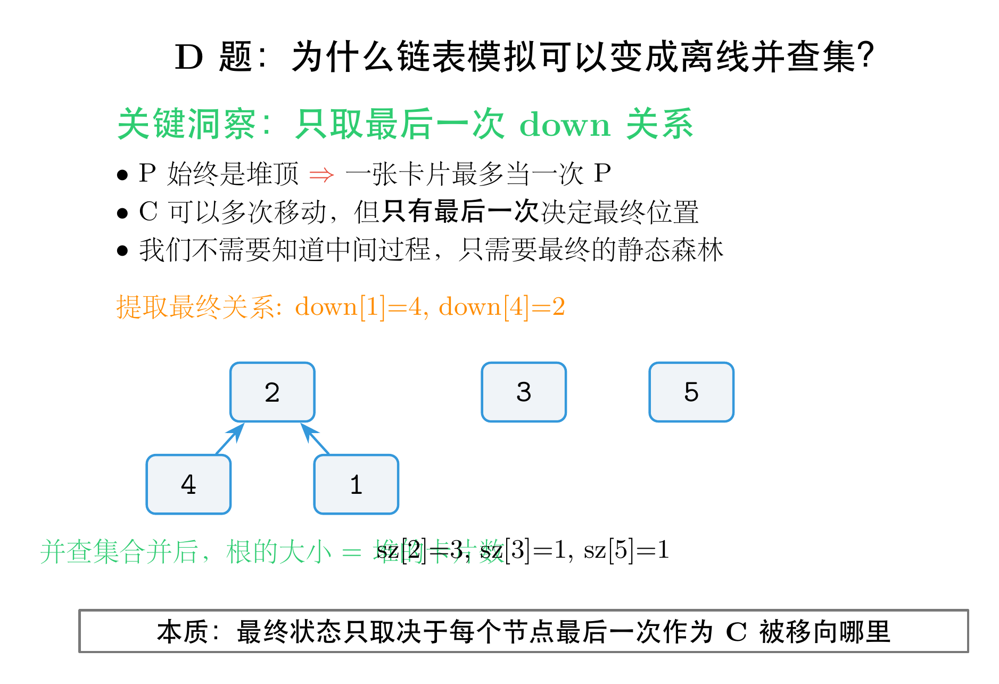

# ABC455 题解：贪心与并查集的巧妙运用

## 一、从直觉到算法：两道经典思维题

这次 ABC455 的 C 题和 D 题，表面上看起来风马牛不相及——一个是数组清零，一个是卡片堆叠——但它们都考察了同一种能力：<span style="color:#e74c3c">把生活化的描述翻译成精确的数据结构语言</span>。

C 题的关键是意识到"选哪些数清零"本质上是一个贪心问题；D 题的关键是发现"堆顶卡片保证"这个条件，让整个过程可以被并查集高效维护。两道题都不需要背诵复杂模板，但对<span style="color:#2980b9">问题建模的敏感度</span>提出了很高的要求。

下面进入具体的题目分析。

---

## 二、C 题：Vanish（贪心 + 频率统计）

### 题意

给定一个长度为 N 的整数序列 A。你需要执行恰好 K 次操作，每次操作选一个整数 x，将所有等于 x 的元素替换为 0。求操作后序列和的最小值。

### 关键观察

这道题最自然的想法是：每次选一个当前出现次数最多的数清零？不对——因为不同的数数值不同，清零 100 出现 1 次，比清零 1 出现 10 次更划算。

正确的思路是<span style="color:#e74c3c">计算每种不同数值的"总贡献"</span>：

- 数值 v 出现了 c 次，那么它的总贡献就是 v × c
- 如果我们把数值 v 清零，就能从总和中减少 v × c

于是问题转化为：有 m 种不同的数值，每种有一个"总贡献"，选 K 个最大的贡献清零，使得剩余的总和最小。

等价地说：把所有总贡献从小到大排序，保留最小的 (m − K) 个，它们的和就是答案。如果 m ≤ K，则所有数值都能被清零，答案为 0。

### 代码

```cpp
#include<bits/stdc++.h>
using namespace std;
using ll = long long;
int main(){
    int n,k;
    cin >> n >> k;
    map<int,int> mp;
    for(int i=1;i<=n;++i){
        int x;
        cin >> x;
        mp[x]++;
    }
    vector<ll> bs;
    for(auto [x,v]:mp) bs.push_back(1ll*x*v);
    sort(bs.begin(),bs.end());
    if(bs.size()<=k) return 0*puts("0");
    int m = bs.size();
    ll ans = 0;
    for(int i=0;i<m-k;++i) ans += bs[i];
    cout << ans << endl;
    return 0;
}
```

### 代码解析

`mp` 用一个 `map` 统计每种数值的出现次数。`bs` 数组存储每种数值的总贡献（数值 × 次数）。

排序后，如果不同数值的种类数 `bs.size()` 不超过 K，直接输出 0。否则累加前 `m-K` 个最小的贡献值，即为最终答案。

时间复杂度主要是排序的 O(m log m)，其中 m 是不同数值的个数，满足 m ≤ N ≤ 3×10^5，完全可以接受。

---

## 三、D 题：Card Pile Query（并查集 + 离线洞察）

### 题意

有 N 张编号 1 到 N 的卡片，初始时卡片 i 单独放在堆 i 中。依次执行 Q 次操作：将卡片 C_i 及其上方所有卡片整体移到卡片 P_i 所在堆的顶部。保证每次操作前，C_i 和 P_i 在不同堆，且 P_i 是某个堆的顶部。求最终每堆的卡片数量。

### 关键观察

这道题如果直接模拟，很容易想到用<span style="color:#e74c3c">链表</span>维护每堆的卡片的上下关系：每张卡片记录它上面和下面分别是哪张卡，每次操作把 C_i 所在子链切断，拼接到 P_i 所在链的顶部。同时还要维护每堆的堆顶指针，方便后续操作定位。

这个思路是对的，但实现起来相当繁琐——链表切断和拼接涉及大量指针调整，代码长且容易出错。有没有更简洁的视角？

#### 观察一：P_i 始终是堆顶

题目明确保证：每次操作的 P_i 都是<span style="color:#e74c3c">某个堆的顶部</span>。这是一个极强的约束。它意味着：

- 当卡片 P_i 接收了 C_i 及其上方的整段卡片后，P_i 被压在了这段卡片的下方，不再是堆顶
- 因此，<span style="color:#2980b9">一张卡片最多只能当一次 P_i</span>——一旦它作为 P_i 接收了别的卡片，它就被埋在了下面，后续操作中不可能再满足"P_i 是堆顶"的条件

#### 观察二：C_i 可以多次移动，但只有最后一次决定最终位置

一张卡片可以多次作为 C_i 被移走吗？可以。第一次作为 C_i 被移到 P_1 上方后，它和它上方的卡片成为一个整体。如果之后这个整体的最底部（仍然是那张卡片）又作为 C_i 被移到 P_2 上方，那么这张卡片最终就在 P_2 的上方。

关键点在于：<span style="color:#e74c3c">当一张卡片再次作为 C_i 被移走时，它之前的"下方支撑"关系就被永久切断了</span>——因为移动的是 C_i 及其上方，之前的支撑卡片被留在了原堆，不会跟着一起移动。

因此，对于每张卡片，我们只需要知道它<span style="color:#2980b9">最后一次作为 C_i 时被移到了哪个 P_i</span>。这就是它最终的"下方支撑"关系。

#### 观察三：整个过程可以离线处理

既然最终结构只取决于每张卡片最后一次的"下方支撑"关系，我们根本不需要在线维护链表！

具体做法：

1. 读入所有操作，对每张卡片记录它最后一次作为 C_i 时的 P_i（用数组 `down[c] = p`）
2. 所有操作处理完后，`down` 数组就描述了一片<span style="color:#8e44ad">静态森林</span>：每个节点最多有一个父节点（它的下方支撑）
3. 用并查集把所有连通块合并，统计每个根节点的大小，就是对应堆的卡片数量

### 图示

下图对比了"在线链表模拟"的直观思路和"离线并查集"的简洁洞察：



左侧是在线链表模拟的思路——每次操作都要切断子链、重新拼接，还要实时维护堆顶指针。右侧是离线洞察：由于 P 始终是堆顶，一张卡片最多当一次 P；而 C 只有最后一次移动决定最终位置。因此我们只需要提取最终的 down 关系，用并查集合并就能得到答案。

以样例 1 为例，5 次操作后有效关系只有 `down[1]=4` 和 `down[4]=2`。并查集合并后，{1,4,2} 形成大小为 3 的堆，3 和 5 各自独立。最终输出 `0 3 1 0 1`。

### 代码

```cpp
#include<bits/stdc++.h>
using namespace std;
using ll = long long;
const int maxn = 3e5+5;
int fa[maxn];
int sz[maxn];
int find(int x){
    if(fa[x]==x) return x;
    return fa[x]=find(fa[x]);
}
void merge(int x, int y) {
    x = find(x);
    y = find(y);
    if (x == y) return;
    fa[y] = x;
    sz[x] += sz[y];
    sz[y] = 0;
}
int main(){
    int n,q;
    cin >> n >> q;
    for(int i=1;i<=n;++i) fa[i]=i;
    for(int i=1;i<=n;++i) sz[i]=1;
    vector<int> down(n+1);
    while(q--){
        int c,p;
        cin >> c >> p;
        down[c] = p;
    }
    for(int i=1;i<=n;++i){
        if(down[i]) merge(down[i],i);
    }
    for(int i=1;i<=n;++i) cout << sz[i] << " \n"[i==n];
    return 0;
}
```

### 代码解析

`fa[i]` 是并查集的父节点数组，`sz[i]` 记录以 i 为根的集合大小。`find` 带路径压缩，`merge` 将 y 所在集合挂到 x 下面。

核心在于 `down[c] = p` 的提取。代码按顺序读入所有操作，后面的操作会自然覆盖前面同一张卡片作为 C_i 的记录，最终保留的恰好就是<span style="color:#e74c3c">最后一次</span>的"下方支撑"关系。

随后遍历所有卡片，如果 `down[i]` 存在，就执行 `merge(down[i], i)`。由于并查集按路径压缩合并，整片森林的根节点会被正确找到，其 `sz` 值就是该堆最终的卡片数。非根节点的 `sz` 已被置为 0，不影响输出。

时间复杂度近似 O(N α(N))，其中 α 是阿克曼函数的反函数，可以视为常数。

---

## 四、写在最后

C 题提醒我们：<span style="color:#e74c3c">不要急着模拟过程，先算清楚每种选择的代价</span>。把"清零某个数"的代价精确量化成"数值 × 出现次数"，贪心策略就自然浮现了。

D 题提醒我们：<span style="color:#2980b9">关注题目中的不变量和保证条件</span>。"P_i 始终是堆顶"这个条件，意味着整个过程可以被压缩成一张静态的森林图，从而避免了复杂的动态链表操作。

两道题的共同点在于——它们都不需要高深的算法模板，但对<span style="color:#8e44ad">观察力和建模能力</span>有很高的要求。而这种能力，正是从一次次实战中磨出来的。

AtCoder Beginner Contest 每周六晚上 20:00 开赛。如果你正在学习算法竞赛，强烈建议你把它变成<span style="color:#e74c3c">每周固定的练习仪式</span>。不需要每道题都做出来，哪怕只做 A~C，长期坚持下来，对题感的提升也是肉眼可见的。

我们下周六晚上见。
