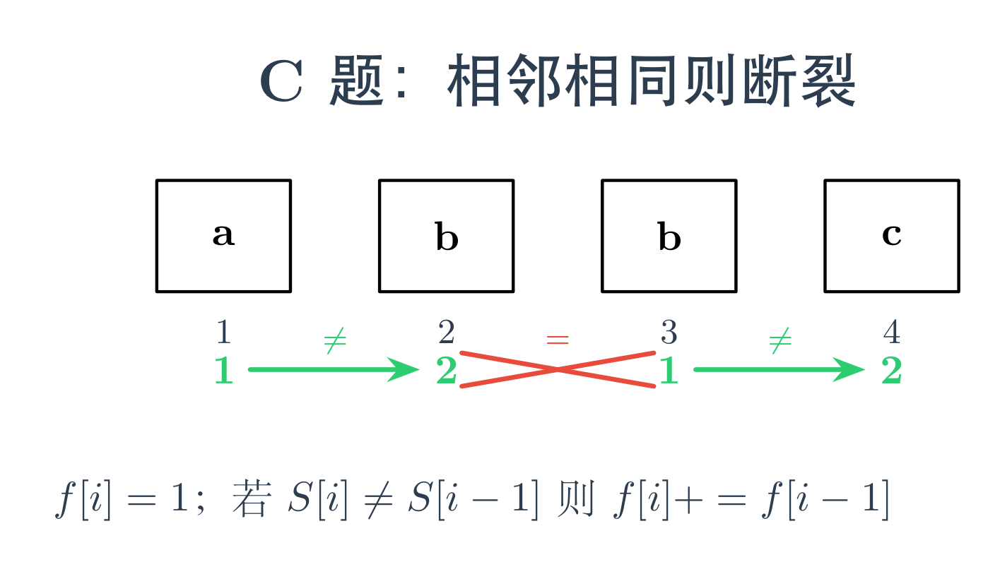
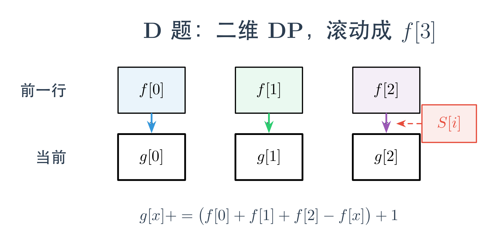

# ABC456 题解：动态规划中的状态设计

## 一、开篇引言

在算法竞赛的学习路径中，动态规划（DP）是一道重要的分水岭。而 DP 中最考验功力的，往往不是写出转移方程，而是<span style="color:#e74c3c">设计合适的状态</span>。

本次 ABC456 的 C 题和 D 题，恰好构成了一组绝佳的对比：两道题的限制条件几乎相同——都要求"相邻字符不能相同"，但仅仅因为一个是<span style="color:#0969da">子串</span>（连续）、一个是<span style="color:#0969da">子序列</span>（可不连续），就会导致完全不同的状态维度设计。

通过这两道题，我们可以深刻体会到：<span style="color:#e74c3c">状态不是拍脑袋想出来的，而是由问题的结构特征决定的</span>。

---

## 二、C 题：Not Adjacent（线性 DP）

### 题意

给定一个由 a、b、c 组成的字符串 S，求其中有多少个非空子串满足"没有两个相邻字符相同"。位置不同的相同子串也要分别计数。答案对 998244353 取模。

### 关键观察

子串是<span style="color:#e74c3c">连续的</span>。这意味着一个合法子串向右延伸时，<span style="color:#0969da">只需要看它右边紧邻的一个字符</span>。

如果我们知道了"以位置 i-1 结尾的合法子串有多少个"，那么：
- 若 S[i] ≠ S[i-1]，这些子串都可以向后延伸一位，再加上"只选 S[i] 自己"这一个新子串
- 若 S[i] = S[i-1]，则无法延伸，只能新建一个单字符子串

### 图示



### 代码

```cpp
#include<bits/stdc++.h>
using namespace std;
int main(){
    string s;
    cin >> s;
    int n = s.size();
    vector<int> f(n+1,1);
    for(int i=1;i<n;++i){
        if(s[i]!=s[i-1]) f[i+1] += f[i];
    }
    long long ans = accumulate(f.begin(),f.end(),-1LL);
    cout << ans%998244353 << endl;
    return 0;
}
```

### 代码解析

- f[i] 表示以第 i 个字符结尾的合法子串个数
- 初始化 f[i] = 1，对应只取 S[i-1] 这一个字符的子串
- accumulate(..., -1LL) 中的 -1 用于扣除 f[0]=1 这个虚拟初始值
- 时间复杂度 O(n)，空间复杂度 O(n)（可进一步优化到 O(1)）

---

## 三、D 题：Not Adjacent 2（二维 DP + 滚动数组）

### 题意

与 C 题类似，但这里要求的是<span style="color:#e74c3c">子序列</span>（可不连续），其余条件不变。

### 关键观察

子序列不要求连续，这意味着当前字符可以接在<span style="color:#0969da">前面任意一个合法子序列</span>的后面，只要最后一个字符不同。

此时，我们不能再像 C 题那样只关心"上一个位置"，因为子序列的"上一个字符"可能出现在很前面。真正需要记住的信息是：<span style="color:#e74c3c">这个子序列以什么字符结尾</span>。

因此定义二维状态：dp[i][j] 表示 s[0..i) 中以字符 j（0 代表 a，1 代表 b，2 代表 c）结尾的合法子序列个数。

### 图示



### 代码

```cpp
#include<bits/stdc++.h>
using namespace std;
using ll = long long;
const int mod = 998244353;
int main(){
    string s;
    cin >> s;
    int n = s.size();
    vector<ll> f(3);
    for(int i=0;i<n;++i){
        auto g = f;
        int x = s[i]-'a';
        g[x] += f[0]+f[1]+f[2]-f[x]+1;
        g[x] %= mod;
        swap(f,g);
    }
    int ans = (f[0]+f[1]+f[2])%mod;
    cout << ans << endl;
    return 0;
}
```

### 代码解析

- 状态本质上是二维的 dp[i][3]，但因为第 i 行只依赖第 i-1 行，所以用<span style="color:#e74c3c">滚动数组</span> f[3] 和 g[3] 交替使用，将空间压到 O(1)
- f[0]+f[1]+f[2]-f[x] 的含义：所有以"不同于当前字符"结尾的合法子序列，都可以把当前字符接在后面
- +1 的含义：单独选当前字符这一个子序列
- g[x] %= mod 保证数值始终在模数范围内
- 最后答案就是三个状态的求和

### C 题与 D 题的状态对比

C 题是<span style="color:#0969da">子串</span>，要求连续，所以只需关心相邻位置，状态是<span style="color:#e74c3c">一维</span>的 f[i]。D 题是<span style="color:#0969da">子序列</span>，不要求连续，必须记住以什么字符结尾，状态是<span style="color:#e74c3c">二维</span>的 dp[i][j]。同样的"不相邻"限制，仅仅因为连续性的差异，就让状态维度从一维跳到了二维。这就是 DP 状态设计的魅力所在。

---

## 四、写在最后

C 题和 D 题虽然分值只有 300 和 400，但背后蕴含的算法思想却非常经典：<span style="color:#0969da">根据问题的结构特征来决定状态的设计</span>。

- 当连续性保证了"只需看相邻位置"时，一维状态足矣
- 当不连续性导致"需要追踪字符种类"时，二维状态才能覆盖所有信息

这种"从问题出发设计状态"的思路，是 DP 从入门到精通的关键一步。

AtCoder Beginner Contest 每周六晚上 20:00 开赛，保持每周打比赛、写题解的节奏，进步会在不知不觉中发生。我们下周六晚上见。
