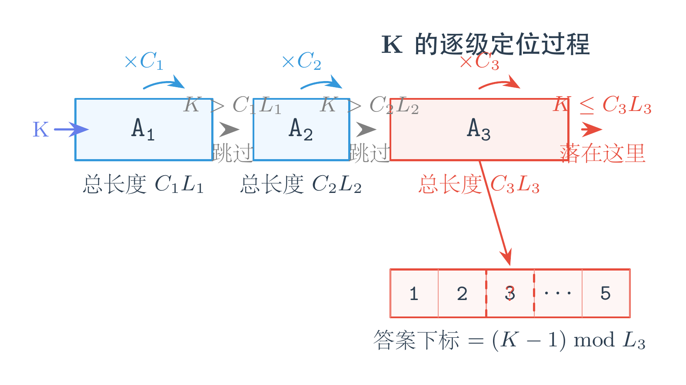
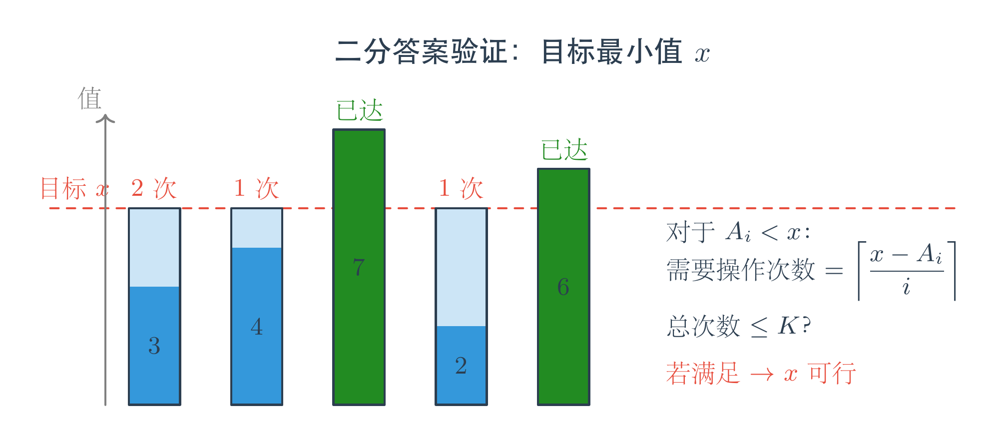

# ABC457 题解：大数困境与二分智慧

## 一、开篇引言

在算法竞赛中，当我们看到<span style="color:#e74c3c">数据范围极大</span>的题目时，第一反应不应该是望而却步，而是冷静思考：问题的结构中是否隐藏着某种性质，让我们可以<span style="color:#0969da">避免真正处理这么大规模的数据</span>？

本次 ABC457 的 C 题和 D 题，恰好展示了两种面对"大数"的经典策略：

- C 题中，重复次数 Ci 可达 10^9，但<span style="color:#0969da">所有序列长度之和却很小</span>，这让我们可以用"跳过"代替"展开"。
- D 题中，数值和 K 都可达 10^18，完全无法暴力枚举，但<span style="color:#0969da">"二分答案"</span>这把利器，能让我们在 log 级别的时间内锁定最优解。

通过这两道题，我们可以学到：<span style="color:#e74c3c">数据范围决定算法选择，而结构特征决定我们能否化繁为简。</span>

---

## 二、C 题：Long Sequence（模拟与跳过）

### 题意

给定 N 个序列 A1, A2, ..., AN，以及 N 个重复次数 C1, C2, ..., CN。

按照顺序，将 Ai 重复拼接 Ci 次，构成一个大序列 B。求 B 的第 K 个元素。

### 关键观察

直接展开 B 是不可能的——Ci 最大 10^9，B 的总长度可能大到天文数字。

但注意一个关键约束：<span style="color:#e74c3c">所有 Li 之和 ≤ 2×10^5</span>。这意味着，虽然每个序列被重复了很多次，但<span style="color:#0969da">不同序列的种类很少</span>。

对于第 i 个序列，它在 B 中占据的总长度是：

<span style="color:#0969da">Ci × Li</span>

如果我们按顺序扫描每个序列，只需要判断 K 是否落在当前这个"大块"里面：
- 若 K > Ci × Li，说明答案还在后面，<span style="color:#0969da">直接把 K 减去这个长度</span>，继续看下一块
- 若 K ≤ Ci × Li，说明答案就在这一块里。由于这一块是 Ai 循环重复，下标直接用 <span style="color:#0969da">(K-1) mod Li</span> 即可

### 图示



### 代码

```cpp
#include<bits/stdc++.h>
using namespace std;

int main(){
    int n; cin >> n;
    long long k; cin >> k;
    vector<vector<int>> a(n);
    for(auto &v:a){
        int L; cin >> L;
        v.resize(L);
        for(auto &x:v) cin >> x;
    }
    vector<int> c(n);
    for(auto &x:c) cin >> x;
    
    for(int i=0;i<n;++i){
        int li = a[i].size();
        long long ac = 1LL*c[i]*li;
        if(k>ac) k -= ac;
        else{
            --k;
            cout << a[i][k%li];
            break;
        }
    }
    return 0;
}
```

### 代码解析

代码的核心逻辑非常简洁：

1. 读入所有序列和重复次数
2. 遍历每个序列，计算 <span style="color:#0969da">ac = Ci × Li</span>
3. 如果 k 大于 ac，说明目标在更后面，执行 <span style="color:#0969da">k -= ac</span> 跳过整块
4. 否则目标就在当前块中，<span style="color:#0969da">--k</span> 将 K 转换为 0-based 下标，再用 <span style="color:#0969da">k % li</span> 得到循环中的具体位置

注意 1LL 的强制类型转换，防止 Ci × Li 在 32 位 int 中溢出。

---

## 三、D 题：Raise Minimum（二分答案）

### 题意

给定长度为 N 的数列 A 和整数 K。

每次操作选择一个下标 i，将 Ai 加上 i。最多进行 K 次操作，求操作后数列<span style="color:#e74c3c">最小值的最大可能值</span>。

### 关键观察

"最小值最大"是<span style="color:#0969da">二分答案</span>的经典信号。

假设我们想让最终的最小值达到 x，需要验证：能否在不超过 K 次操作内，让所有 Ai 都至少等于 x？

对于第 i 个位置（注意下标从 1 开始）：
- 若 Ai ≥ x，已经满足，不需要操作
- 若 Ai < x，每次操作只能加 i，因此至少需要 <span style="color:#0969da">ceil((x - Ai) / i)</span> 次操作

在整数运算中，ceil((x - Ai) / i) 可以写成 <span style="color:#0969da">(x - Ai + i - 1) / i</span>。

把所有位置需要的操作次数加起来，如果总和 ≤ K，则 x 可行；否则不可行。

二分搜索的范围：下界显然是 1，上界可以取 <span style="color:#0969da">A1 + K + 1</span>（因为下标 1 的位置每次只能加 1，最多提升 K）。

### 图示



### 代码

```cpp
#include<bits/stdc++.h>
using namespace std;
using ll = long long;

const int maxn = 2e5+5;
ll a[maxn];
int n;
ll k;

bool check(ll x){
    ll tot = 0;
    for(int i=1;i<=n;++i){
        if(a[i]>=x) continue;
        tot += (x-a[i]+i-1)/i;
        if(tot>k) return false;
    }
    return true;
}

int main(){ 
    cin >> n >> k;
    for(int i=1;i<=n;++i)
        cin >> a[i];
    
    ll L=1, R=a[1]+k+1;
    while(R-L>1){
        ll mid = L+(R-L)/2;
        if(check(mid)){
            L = mid;
        }else{
            R = mid;
        }
    }
    cout << L << endl;
    return 0;
}
```

### 代码解析

1. <span style="color:#0969da">check(x)</span> 函数是验证的核心：遍历每个元素，计算让它达到 x 所需的操作次数，累加到 tot。一旦 tot 超过 K 就提前返回 false，避免不必要的计算。

2. <span style="color:#0969da">左闭右开的二分写法</span>：代码中使用的是 `while(R-L>1)` 的循环条件，这是一种非常清晰的二分模式。
   - 始终保持 <span style="color:#e74c3c">L 可行、R 不可行</span>的不变性
   - 当区间缩到只剩相邻两个数时停止，此时 <span style="color:#0969da">L 就是最大的可行值</span>
   - 与常见的 `L<=R` 写法相比，这种写法不需要考虑 `mid` 边界偏移，代码更简洁，也更容易避免死循环

3. <span style="color:#0969da">左右端点的初始化逻辑</span>：
   - <span style="color:#0969da">L = 1</span>：因为所有 Ai ≥ 1，最小值至少能维持 1，所以 L 一定可行
   - <span style="color:#0969da">R = a[1] + K + 1</span>：位置 1 每次操作只能加 1，最多提升 K，所以 a[1]+K 一定可达。而 R 取 <span style="color:#e74c3c">a[1]+K+1</span>，这是一个<span style="color:#e74c3c">明确不可行</span>的值，作为上界刚好比答案大 1，保证二分收敛后 L 就是精确答案

4. 注意数组下标从 1 开始，这与题目中"加上 i"的定义一致。

---

## 四、结语

C 题教会我们：面对"重复次数极大"的问题，先看看<span style="color:#0969da">不同结构的总数</span>是否可控。如果种类有限，就可以用"跳过整块"代替"逐一枚举"。

D 题则展示了<span style="color:#0969da">二分答案</span>的威力：当我们需要求"最大值的最小"或"最小值的最大"时，与其正向构造，不如反向验证——给定一个目标值，判断它是否可达，往往比直接求最优解简单得多。

每周的 ABC 都是一次思维训练。坚持参加、坚持复盘，你会发现自己的算法直觉正在悄然生长。
